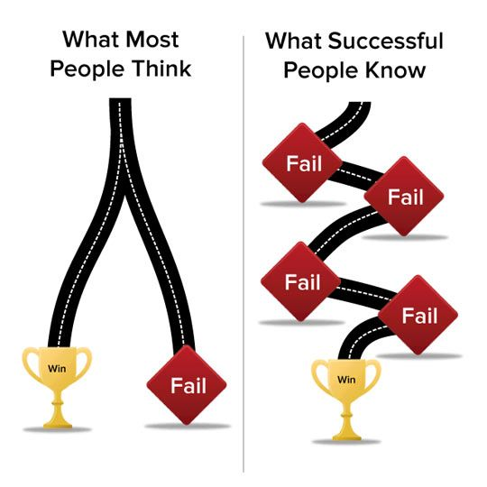
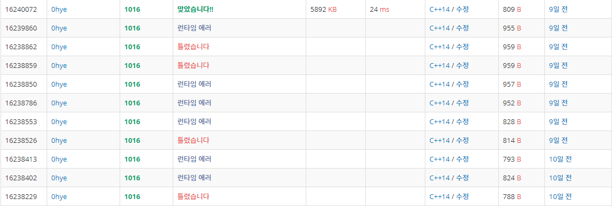

# BOJ-0hye
백준 온라인 저지 뿌셔뿌셔

## 목표

졸업 전 까지 학교 랭킹 30위권 찍기

## 나와의 약속

아무리 바빠도 2주에 한 문제는 꼭 풀기

## 알고리즘 문제를 푸는 자세(=인생을 대하는 자세)

성공으로 가는 길은 실패의 연속

## 팁
런타임 에러가 발생하는 경우 [참고 링크](https://www.acmicpc.net/board/view/22980)
- 배열에 할당된 크기를 넘어서 접근했을 때
- 전역 배열의 크기가 메모리 제한을 초과할 때
- 지역 배열의 크기가 스택 크기 제한을 넘어갈 때
- 0으로 나눌 때
- 라이브러리에서 예외를 발생시켰을 때
- 재귀 호출이 너무 깊어질 때
- 이미 해제된 메모리를 또 참조할 때

cout 사용할 때, 줄 넘김을 해야하는 경우 'endl' 보다 '\n' 을 사용하자. endl 은 내부적으로 아웃풋 버퍼라는 녀석을 flush 하는 과정이 포함되어 있어 느리다고한다.

## 동기부여

[PS공부 하면서 좌절감을 느낀 분들이 읽어봤으면 하는 나의 2016년](https://plzrun.tistory.com/entry/PS%EA%B3%B5%EB%B6%80%EB%A5%BC-%ED%95%98%EB%A9%B4%EC%84%9C-%EC%A2%8C%EC%A0%88%EA%B0%90%EC%9D%84-%EB%8A%90%EB%82%80-%EB%B6%84%EB%93%A4%EC%9D%B4-%EC%9D%BD%EC%96%B4%EB%B4%A4%EC%9C%BC%EB%A9%B4-%ED%95%98%EB%8A%94-%EB%82%98%EC%9D%98-2016%EB%85%84)

[알고리즘 문제풀이(PS) 시작하기](https://plzrun.tistory.com/entry/%EC%95%8C%EA%B3%A0%EB%A6%AC%EC%A6%98-%EB%AC%B8%EC%A0%9C%ED%92%80%EC%9D%B4PS-%EC%8B%9C%EC%9E%91%ED%95%98%EA%B8%B0)

[알고리즘 공부, 어떻게 해야하나요?](https://baactree.tistory.com/52)

### 기록

**10분 안에 푼 문제는 기록하지 않음**

2019.11.22, 1002번 터렛

2019.11.23~24, 1016번 제곱ㄴㄴ수

2019.12.01~12.04, 1068번 트리

2019.12.04~, 2581번 소수
