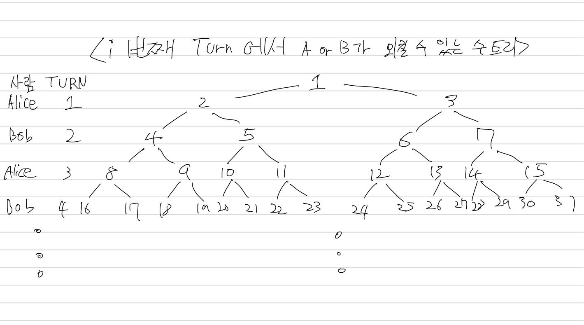
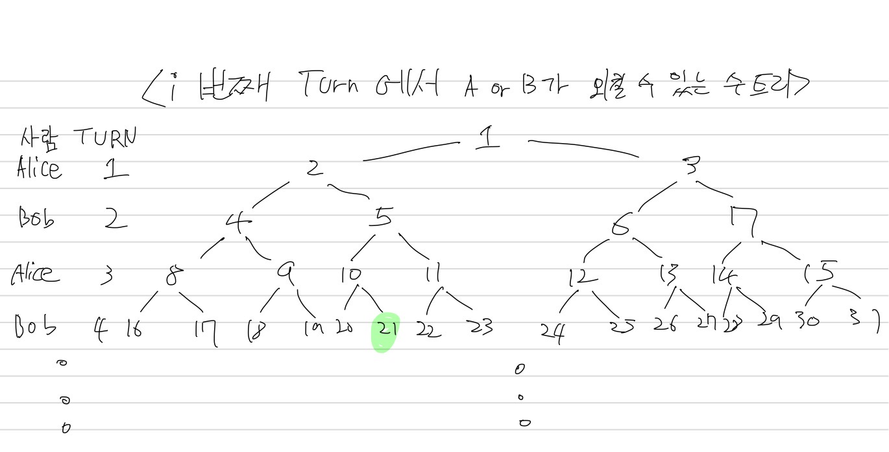
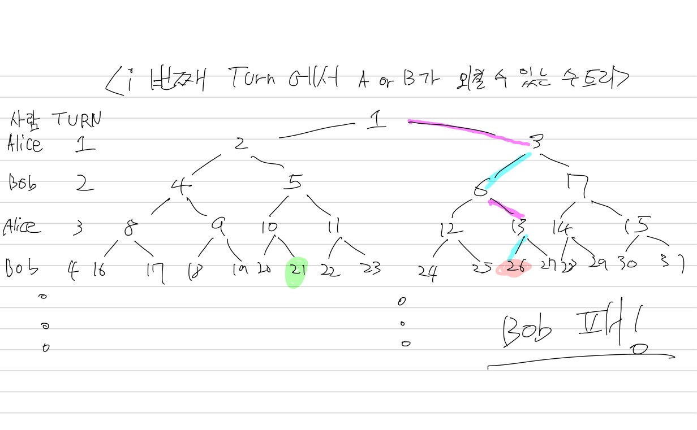
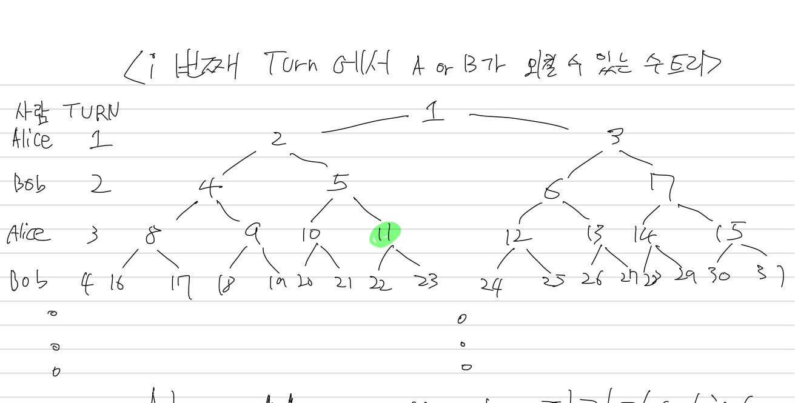
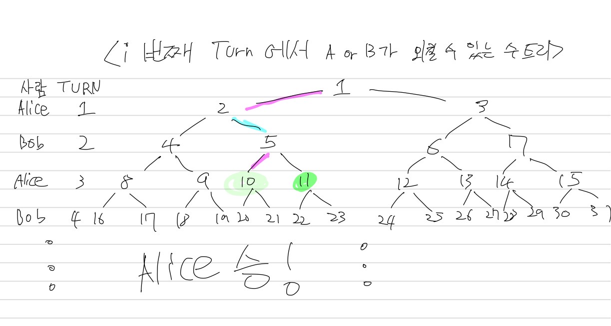

# 승자예측하기

## N = 21 일 때

Turn 4 에서 Bob 은 [16, 31] 의 숫자를 외칠 수 있다.

이 때, Turn 4 에서 Bob 은 **[16, 21]** 의 숫자를 외쳐야 게임에서 이길 수 있다. (Turn 5 에서 Alice 가 무조건 N(21) 보다 큰 수를 외치기 때문)

=> Bob은 Turn 4 에서 21 이랑 같거나 작은 수를 외칠 수 있도록 매 차례 마다 x 의 증가폭이 최소가 되도록 해야한다.

**=> Rule 1. Bob은 자기 차례에서 x mul 2 를 외쳐야 한다.**

반대로, Alice 는 Bob이 Turn 4에서 [22, 31] 의 숫자를 외치도록 유도해야 게임에서 이길 수 있다.

=> Alice 는 Turn 4 에서 Bob 이 21보다 큰 수를 외칠 수 있도록 매 차례 마다 x 의 증가폭이 최대가 되도록 해야한다.

**=> Rule 2. Alice 는 자기 차례에서 x mul 2 + 1 을 외쳐야 한다.**

**Rule 1 과 Rule 2 는 Bob의 차례에서 N 을 외칠 수 있는 경우 무조건 적용된다.**

## N = 11 일 때

Turn 3 에서 Alice 는 [8, 15] 의 숫자를 외칠 수 있다.

이 때, Turn 3 에서 Alice 는 **[8, 11]** 의 숫자를 외쳐야 게임에서 이길 수 있다. (Turn 4 에서 Bob 이 무조건 N(11) 보다 큰 수를 외치기 때문)

=> Alice 는 Turn 3 에서 11 이랑 같거나 작은 수를 외칠 수 있도록 매 차례 마다 x 의 증가폭이 최소가 되도록 해야한다.

**=> Rule 3. Alice 는 자기 차례에서 x mul 2 를 외쳐야 한다.**

반대로, Bob 은 Alice 가 Turn 3에서 [12, 15] 의 숫자를 외치도록 유도해야 게임에서 이길 수 있다.

=> Bob 는 Turn 4 에서 Alice 가 11보다 큰 수를 외칠 수 있도록 매 차례 마다 x 의 증가폭이 최대가 되도록 해야한다.

**=> Rule 4. Bob 은 자기 차례에서 x mul 2 + 1 을 외쳐야 한다.**

**Rule 3 과 Rule 4 는 Alice의 차례에서 N 을 외칠 수 있는 경우 무조건 적용된다.**

