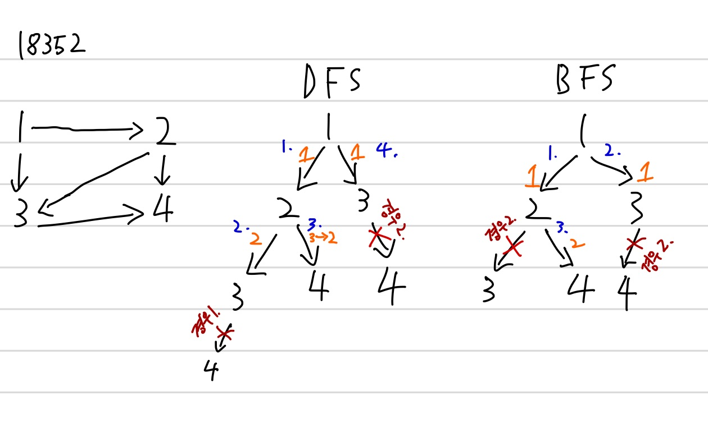

# 특정 거리의 도시 찾기

도시: {city_1, city_2, ..., city_N}

출발도시 city_X 로부터 다른 도시 city_i{i != X} 를 방문하면서 (BFS 이용)

출발도시 city_X 로부터 방문하는 도시 city_i 까지의 거리를 기록함

위 동작을 수행하며 아래의 2 가지 경우, 다음 도시로 방문(탐색)을 중단

1. 출발도시 city_X로부터 다음 도시까지의 이동거리가 K 거리를 넘어가게 되는 경우

2. 이미 다음 도시를 다른 경로를 통해 더 짧거나 동일한 거리로 방문한적이 있는 경우

방문 가능한 모든 도시의 방문이 끝나면 출발도시 city_X 로부터 다른 도시 city_i{i != X, 이동 거리가 K 이하인 도시}까지의 거리가 모두 나옴

거리 K에 해당하는 도시들을 출력

## BFS vs DFS

DFS 를 이용하면 경우 2. 에 의하여 탐색을 하지 않아도 되는 경로(1->2->3)를 탐색할 수도 있음

