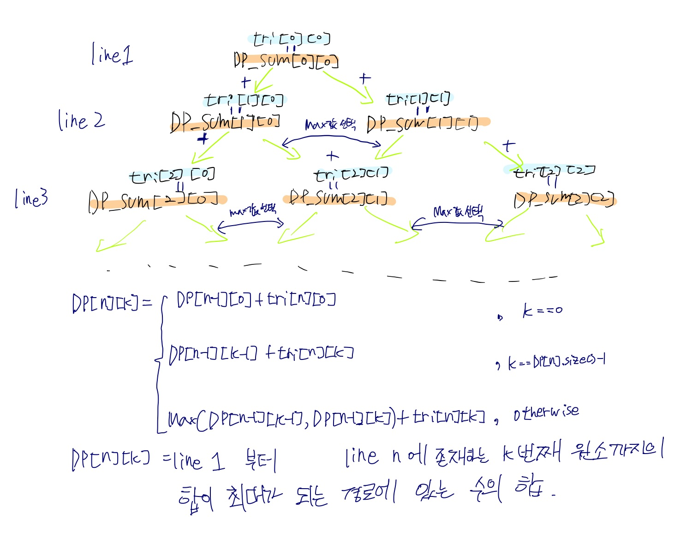

# 정수 삼각형

스스로의 힘으로 푼 문제!

삼각형을 이루는 원소 값들을 저장하는 2차원 배열을 tri 라 하고 각 원소들의 합을 저장하는 2차원 배열을 DP_sum 이라고 할 때,

삼각형의 첫번째 줄로 부터 n 번째 줄에 존재하는 k 번째 원소까지의 합이 최대가 되도록 식을 세울 수 있다.

그 과정은 아래의 그림과 같다.



```cpp
if (j == 0) temp = dp_sum[i-1][0];
else if (j == dp_sum[i].size()-1) temp = dp_sum[i-1][dp_sum[i-1].size()-1];
else temp = max(dp_sum[i-1][j-1], dp_sum[i-1][j]);

dp_sum[i][j] = temp + triangle[i][j];
```

## 고찰

다이나믹 프로그래밍의 위력을 알 수 있었던 문제
